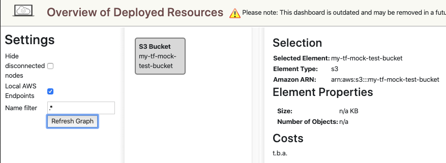

# Terraform Mock AWS Provider With Docker and LocalStack

terraform-mock-aws-prodiver: Sandbox with Amazon Linux and Terraform. AWS APIS are mocked with LocalStack.

## How to Install?
```bash
git clone https://github.com/herrera-luis/terraform-mock-aws-provider.git
cd terraform-mock-aws-provider/
./terraform-docker.sh build
```

## How to Run?
Terminal 1
```bash
./terraform-docker.sh localstack
```
Output:
```bash
Waiting for all LocalStack services to be ready
2019-11-04 21:38:38,936 CRIT Supervisor is running as root.  Privileges were not dropped because no user is specified in the config file.  If you intend to run as root, you can set user=root in the config file to avoid this message.
2019-11-04 21:38:38,944 INFO supervisord started with pid 14
2019-11-04 21:38:39,948 INFO spawned: 'dashboard' with pid 20
2019-11-04 21:38:39,952 INFO spawned: 'infra' with pid 21
(. .venv/bin/activate; bin/localstack web)
2019-11-04 21:38:39,971 INFO success: dashboard entered RUNNING state, process has stayed up for > than 0 seconds (startsecs)
(. .venv/bin/activate; exec bin/localstack start --host)
2019-11-04 21:38:40,973 INFO success: infra entered RUNNING state, process has stayed up for > than 1 seconds (startsecs)
2019-11-04T21:38:44:WARNING:bootstrap.py: Unable to load plugins from file /opt/code/localstack/.venv/lib/python3.6/site-packages/localstack_ext/plugins.py: No module named 'localstack_ext.utils.aws.aws_models'
Starting local dev environment. CTRL-C to quit.
Waiting for all LocalStack services to be ready
Starting mock ES service (http port 4578)...
Starting local Elasticsearch (http port 4571)...
Starting mock S3 (http port 4572)...
Starting mock SNS (http port 4575)...
2019-11-04T21:38:47:INFO:localstack.multiserver: Starting multi API server process on port 51492
Starting mock SQS (http port 4576)...
Starting mock SES (http port 4579)...
Starting mock SSM (http port 4583)...
Starting mock STS (http port 4592)...
Starting mock IAM (http port 4593)...
Starting mock Secrets Manager (http port 4584)...
Starting mock API Gateway (http port 4567)...
Starting mock DynamoDB (http port 4569)...
Starting mock DynamoDB Streams service (http port 4570)...
Starting mock Firehose service (http port 4573)...
Starting mock Lambda service (http port 4574)...
Starting mock Kinesis (http port 4568)...
Starting mock Redshift (http port 4577)...
Starting mock Route53 (http port 4580)...
Starting mock CloudFormation (http port 4581)...
Starting mock CloudWatch (http port 4582)...
Starting mock CloudWatch Events (http port 4587)...
Starting mock CloudWatch Logs (http port 4586)...
Starting mock StepFunctions (http port 4585)...
Starting mock EC2 (http port 4597)...
Waiting for all LocalStack services to be ready
Waiting for all LocalStack services to be ready
Waiting for all LocalStack services to be ready
2019-11-04T21:39:10:WARNING:infra.py: Service "elasticsearch" not yet available, retrying...
Waiting for all LocalStack services to be ready
Waiting for all LocalStack services to be ready
Waiting for all LocalStack services to be ready
Ready.
```
## Create AWS Mock Resources
Terminal 2
```bash
./terraform-docker.sh run
```
Output:
```bash
Initializing provider plugins...

The following providers do not have any version constraints in configuration,
so the latest version was installed.

To prevent automatic upgrades to new major versions that may contain breaking
changes, it is recommended to add version = "..." constraints to the
corresponding provider blocks in configuration, with the constraint strings
suggested below.

* provider.aws: version = "~> 2.34"

Terraform has been successfully initialized!

You may now begin working with Terraform. Try running "terraform plan" to see
any changes that are required for your infrastructure. All Terraform commands
should now work.

If you ever set or change modules or backend configuration for Terraform,
rerun this command to reinitialize your working directory. If you forget, other
commands will detect it and remind you to do so if necessary.
aws_s3_bucket.b: Creating...
  acceleration_status:         "" => "<computed>"
  acl:                         "" => "public-read"
  arn:                         "" => "<computed>"
  bucket:                      "" => "my-tf-mock-test-bucket"
  bucket_domain_name:          "" => "<computed>"
  bucket_regional_domain_name: "" => "<computed>"
  force_destroy:               "" => "false"
  hosted_zone_id:              "" => "<computed>"
  region:                      "" => "<computed>"
  request_payer:               "" => "<computed>"
  versioning.#:                "" => "<computed>"
  website_domain:              "" => "<computed>"
  website_endpoint:            "" => "<computed>"
aws_s3_bucket.b: Creation complete after 0s (ID: my-tf-mock-test-bucket)

Apply complete! Resources: 1 added, 0 changed, 0 destroyed.

Outputs:

address = my-tf-mock-test-bucket
```

## Show your AWS Mock

goto: http://localhost:8080/#/infra

 


## Destroy AWS Mock Resources

```bash
./terraform-docker.sh destroy
```
Output:
```bash
Refreshing Terraform state in-memory prior to plan...
The refreshed state will be used to calculate this plan, but will not be
persisted to local or remote state storage.

aws_s3_bucket.b: Refreshing state... (ID: my-tf-mock-test-bucket)

------------------------------------------------------------------------

An execution plan has been generated and is shown below.
Resource actions are indicated with the following symbols:
  ~ update in-place

Terraform will perform the following actions:

  ~ aws_s3_bucket.b
      object_lock_configuration.#:            "1" => "0"
      replication_configuration.#:            "1" => "0"
      server_side_encryption_configuration.#: "1" => "0"


Plan: 0 to add, 1 to change, 0 to destroy.

------------------------------------------------------------------------

Note: You didn't specify an "-out" parameter to save this plan, so Terraform
can't guarantee that exactly these actions will be performed if
"terraform apply" is subsequently run.

aws_s3_bucket.b: Refreshing state... (ID: my-tf-mock-test-bucket)
aws_s3_bucket.b: Destroying... (ID: my-tf-mock-test-bucket)
aws_s3_bucket.b: Destruction complete after 0s

Destroy complete! Resources: 1 destroyed.
```

## How do make changes in terraform ?

Just go to src/main.tf and update or add more resources. There are specific configs there in order to mock aws with localstack.
